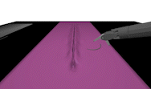

# End-to-End Deep Visual Control for Mastering Needle-Picking Skills With World Models and Behavior Cloning

Official implemetation of needle picking with [Efficient-Dreamer]([xxx](https://github.com/linhongbin/efficient-dreamer)).




For more information:
- [Project Website](https://sites.google.com/view/dreamerbc/home)
## Feature

- Benchmark on [AccelNet Surgical Challenge](https://github.com/collaborative-robotics/surgical_robotics_challenge)
- Support multiple needle variations
- Integration with [gym](https://github.com/openai/gym), [dVRK](https://github.com/jhu-dvrk)

## Requirement
  OS: 
  - Ubuntu 20.04

  Test Hardwares:
  - CPU: 8 Cores, speed of 3.2Ghz
  - GPU: NVIDIA 3070 and 3090

  Minimal requirment:
  - GPU: 8G RAM

## Install

Our code was tested in 

- Install [ROS Noetic](http://wiki.ros.org/noetic/Installation/Ubuntu) for supporting AMBF simulation

- Install [Anaconda](https://www.anaconda.com/download)

- Modified setting file, [setting.sh](./bash/setting.sh), if needed

- Easily install our code with a bash file: [run.sh](./bash/install/setting.sh), run the following command:

  ```sh
  source ./bash/install/run.sh
  ```
## Run
  For all command lines, we assume the current directory is `<path to gym-suture>`, otherwise, change directory by
  ```sh
  cd <path to gym-suture>
  ```
### 1. Launch simulator
- **Launch roscore, open 1st terminal and type**
  ```
  roscore
  ```

- **Launch simulator, open 2st terminal and type**
  ```sh
  source ./bash/ambf/simulator_phantom_rgb.sh # For standard needle
  ```
  > To evaluate different needle variations, type the following commands instead:
  >
  >  ```sh
  >  source ./bash/ambf/simulator_phantom_rgb_small.sh # >For small needle
  >  ```
  >  ```sh
  >  source ./bash/ambf/simulator_phantom_rgb_large.sh # For large needle
  >  ```
  >  ```sh
  >  source ./bash/ambf/simulator_phantom_rgb_unregular.sh # For irregular shape 1
  >  ```
  >  ```sh
  >  source ./bash/ambf/simulator_phantom_rgb_unregular2.sh # For irregular shape 2
  >  ```

- **Launch crtk interface for control, open 3st terminal and type**
  ```sh
  source bash/ambf/crtk.sh
  ```

- **Reset robotic arm to ready position, open 4st terminal and type**
  ```sh
  source bash/ambf/reset.sh 
  ```
### 2. Start Training

- **Train with Efficient-Dreamer**
  ```sh
  source bash/ambf/init.sh
  python ext/efficient-dreamer/example/suture_json.py --default-json ./ext/efficient-dreamer/example/jsons/suture_np/default_np.yaml --section 1 --logdir ./data/rl_log
  ```
  It will take 3 days on RTX3070 GPU (2 days on RTX 3090)  for convergence of evaluated succeses rate (reaching 80%).
  > Resuming training is supported. To resume training, you need to use different seed number and use the same section number w.r.t. your preivous training, take the previous command for example, you can run
  > ```
  > python ext/efficient-dreamer/example/suture_json.py --default-json ./ext/efficient-dreamer/example/jsons/suture_np/default_np.yaml --section 1 --logdir ./data/rl_log --seed 2
  >```


- **Train with other baselines**
  
  Baseline: [Dreamer](https://danijar.com/project/dreamerv2/)
  ```sh
  source bash/ambf/init.sh
  python ext/efficient-dreamer/example/suture_json.py --default-json ./ext/efficient-dreamer/example/jsons/suture_np/default_np.yaml --json ./ext/efficient-dreamer/example/jsons/suture_np/Dreamer.yaml --section 1 --logdir ./data/rl_log
  ```

### 3. Evaluation

  To evaluate a train model, you need to use ```--only-eval``` flag and ```--json``` for the directory to ```<train-log-path>/config.yaml```, for example:

  ```sh
  python ext/efficient-dreamer/example/suture_json.py --json ./data/rl_log/ambf-phantom-psm2-segment_script-zoom_needle_boximage-prefill8000-clutch6/Efficient-Dreamer/1/config.yaml --only-eval
  ```

### 4. Getting Familiar With `gym_suture`

  you can play with `gym_suture` interactively by typing
  ```sh
  source bash/ambf/init.sh
  python example/gym_env.py
  ```
  press keyboard `q` to quit and press other keys to proceed. For details, you can check out [example](./example/)

### 5. Reproducing Experiments.

  To reproduce experiments in [our paper](), you can refer to folder [exp](./exp)

## Citation
If you find it useful, you can cite our paper:
```
@article{lin2023end,
  title={End-to-End Deep Visual Control for Mastering Needle-Picking Skills With World Models and Behavior Cloning},
  author={Lin, Hongbin and Li, Bin and Chu, Xiangyu and Dou, Qi and Liu, Yunhui and Au, Kwok Wai Samuel},
  journal={arXiv preprint arXiv:2303.03675},
  year={2023}
}
```


